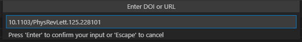
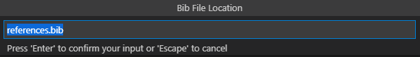
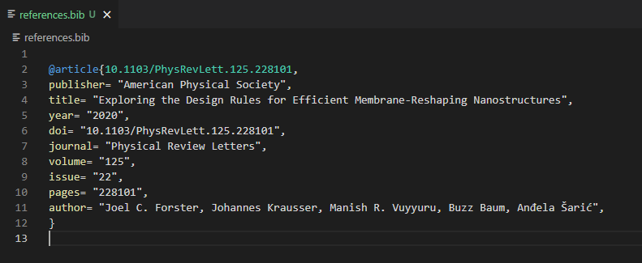

# doi-adder README

This extension allows the user to easily add citations to a bibtex file from either a DOI or URL. This is still in its alpha testing, so may not work for all journals.

It is heavily based on a feature of the org-ref package for emacs, by Professor John Kitchin, https://github.com/jkitchin/org-ref.

## Features

To quickly add a reference to a `.bib` file, open the command palette (`Ctrl + Shift + p`), run `DOI: Add entry to file`:

enter the DOI or URL,

then enter the path to the bib file (the extension will create it if it doesn't exist). The extension will the retrieve the citiation if possible, adding it to the bib file:

To insert a reference at the current cursor position, open the command palette (`Ctrl + Shift + p`), run `DOI: Insert entry`:

enter the DOI or URL, and it will be inserted at your current cursor:

## Requirements

This extension has no extenal requirements.

## Extension Settings

- `doi-adder.refName`: Format for the inserted reference name (citekey)
    + `authorYear` -- use `<lastname><YYYY>` for citekey
    + `doi` -- use (lowercase) `<doi>` for citekey

## Known Issues

- Limited choices for reference name/citekey format.

## Release Notes

### [0.0.1]

- Initial release.

### [0.0.2]

- Fixed issue with authors being separated with commas instead of 'and'
- Changed info setter to find specific bits of info, to avoid unnecessary data being added

### [1.0.0]
- Major refactor to use accept headers instead of parsing publisher website. This should massively increase the reliability of the code, which should now work for all valid DOIs
- Reference will now not be added if bib file contains the doi in question.

### [1.0.1]
- Added `DOI: Insert entry` command.
- Added config option to switch between `doi` and `authorYYYY` citekey formats.

### [1.0.2]
- fixed bug when bibtex response includes html
